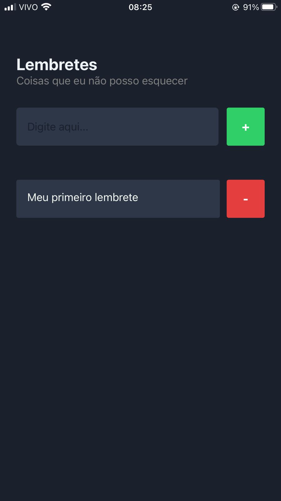
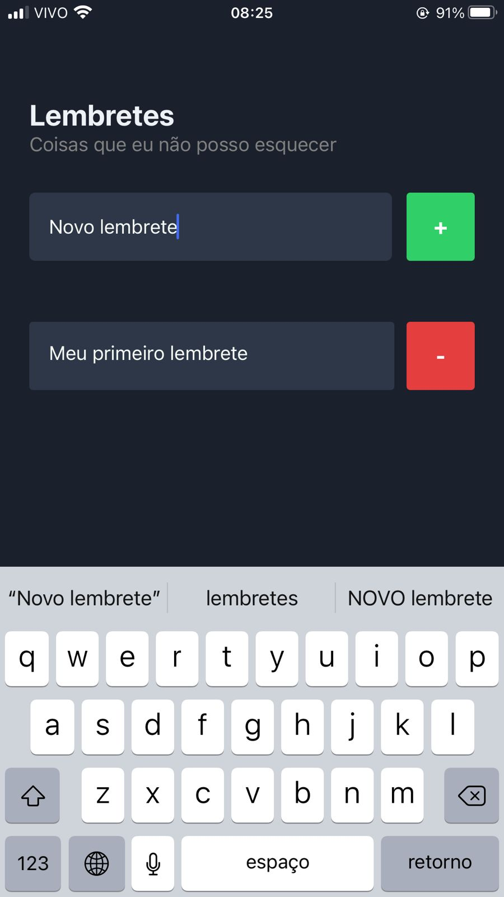
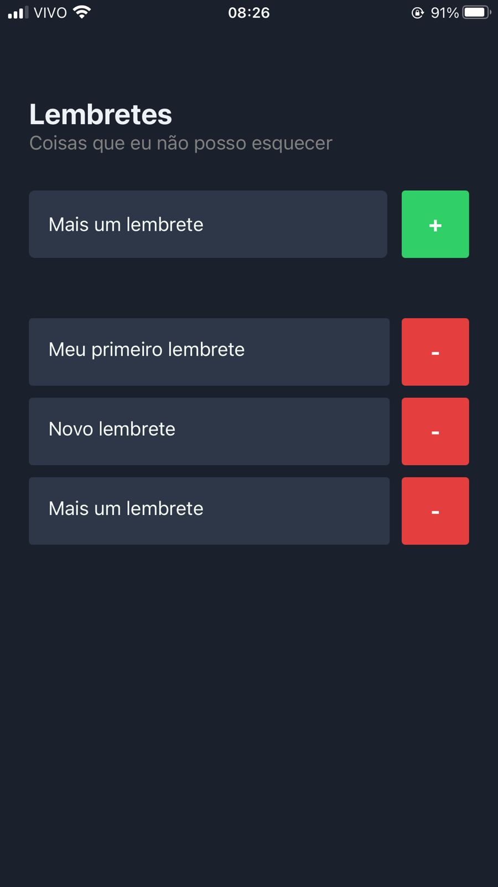

# ListApp

Listing app made with React Native :) It is possible to create/delete reminders:





## Inicialization

First, it is necessary to install the node_modules directory to link all the dependencies: 

```
npm install
```

Using Expo: 

```
expo start
```


